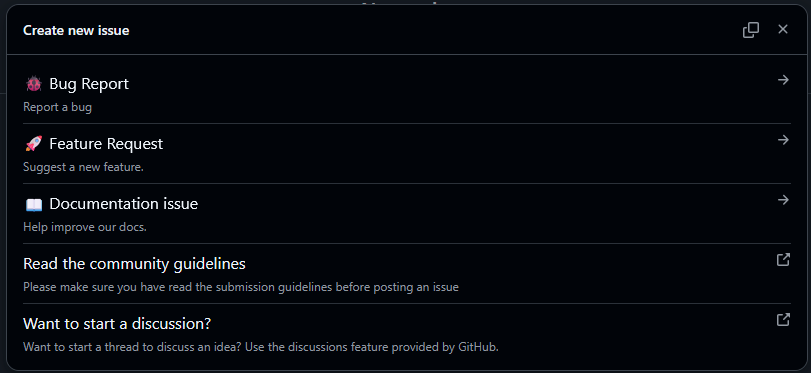

# Issue templates

The content of this folder are templates we use to create issues in our GitHub projects.

In repositories, these files should be placed in a `ISSUE_TEMPLATE/` or `.github/ISSUE_TEMPLATE` folder.

You can also include a `.github/ISSUE_TEMPLATE/config.yml` file to customize the behavior of the *New Issue* button on GitHub. We recommend the following configuration (take care to replace the URLs and email address!):

```yml
blank_issues_enabled: false
contact_links:
  - name: Read the community guidelines
    about: "Please make sure you have read the submission guidelines before posting an issue"
    url: https://github.com/OWNER_NAME/PACKAGE_NAME/blob/main/CONTRIBUTING.md
  - name: Want to start a discussion?
    about: "Join our Discord server to start chatting with the community and the core team"
    url: https://discord.gg/bMK2d47JaE
  - name: Contact us
    url: mailto:dev@sideways-experiments.com
    about: "Feel free to contact us if you need any help or want to know more about our work"
```

By using our templates and this config, you will get a popup like this when clicking on the *New Issue* button on GitHub:



## Summary

- [Bug report template](1-bug.md)
- [Feature request template](2-feature.md)
- [Documentation issue template](3-documentation.md)